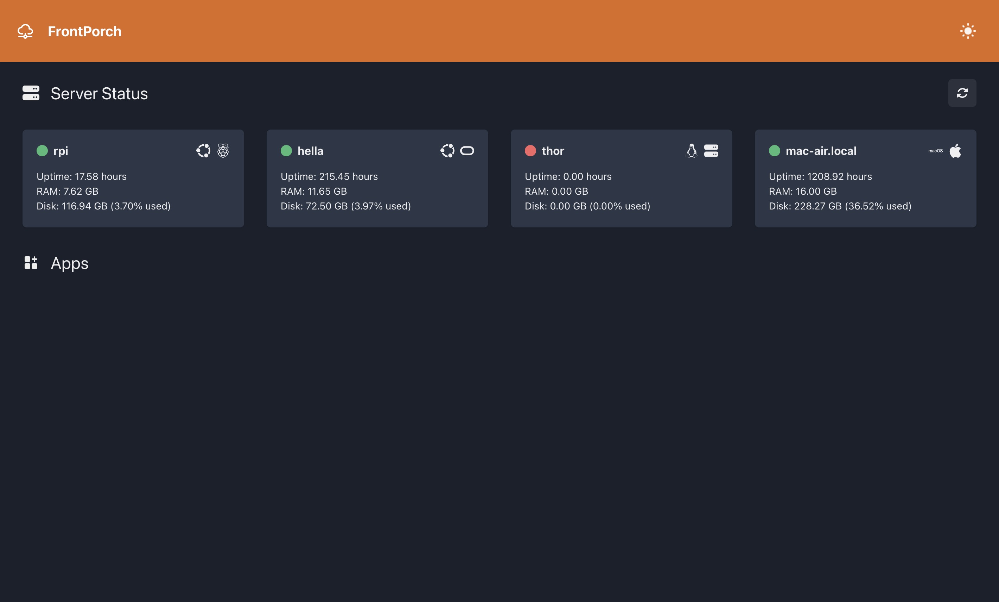

# FrontPorch

FrontPorch is a configurable dashboard designed for homelabs. It provides a comprehensive view of your server status, Docker-related information, and configurable links and widgets through a YAML file.

## Goals

- Have basic monitoring for all of the servers included in my homelab setup without the need to setup a full blown monitoring stack
- Add links for frequently accessed services
- Add some useful interactive apps

## Features

- **Server Status:** Monitor the status of your servers, including uptime, RAM usage, and disk usage.
- **Docker Integration:** Display Docker-related information if Docker is installed on your system.
- **Configurable Dashboard:** Customize links and widgets through a YAML configuration file.
- **Dark and Light Mode:** Switch between dark and light mode for better readability.

## Screenshots

### Dark Mode



### Light Mode


## Installation

> [!NOTE]
> Ready to install standalone binaries will soon be launched once I figure out the build automation flow and a place to upload the assets. Till then, you will have to build from source to be able to run this project.

### Prerequisites

Go (latest version)
Node.js (latest version)
Docker (optional, for Docker-related features)

### Steps

1. Clone the repository:

```bash
git clone https://github.com/sdabhi23/frontporch.git
cd frontporch
```

2. Build the server / daemon component:

```bash
cd backend
go build
```
3. Build the client component:

```bash
cd frontend
npm install
npm run build
```

4. Configure the dashboard:
Create a `config.yaml` file in the root directory with your preferred settings.

5. Run the server:

```bash
./dist/frontporch --config-file=config.yaml
```

6. Access FrontPorch:
Open your browser and go to `http://<your-homelab-ip>:8080`

## Configuration
Configure FrontPorch using the config.yaml file. Here’s an example configuration:

```yaml
# config.yaml
task: server # can be server / daemon
http:
  port: 8080
  host: 0.0.0.0
  static_file_dir: ../frontend/dist # only required for server mode
# sections below are only required for server mode
servers:
  - host: rpi # ip or dns name of your other server
    port: 8080
  - host: hella
    port: 8080
  - host: thor
    port: 8080
```

## Daemon Component

To run the backend as a daemon on other servers, adjust the configuration file and start the backend service. Example config for daemon mode is available in the repo as [backend/sample-config.daemon.yaml](backend/sample-config.daemon.yaml)

## Contributing

Contributions are welcome! Please fork the repository and create a pull request.

## License

This project is licensed under the MIT License. See the [LICENSE](LICENSE) file for details.

## Contact

For any questions or suggestions, feel free to open an issue!
